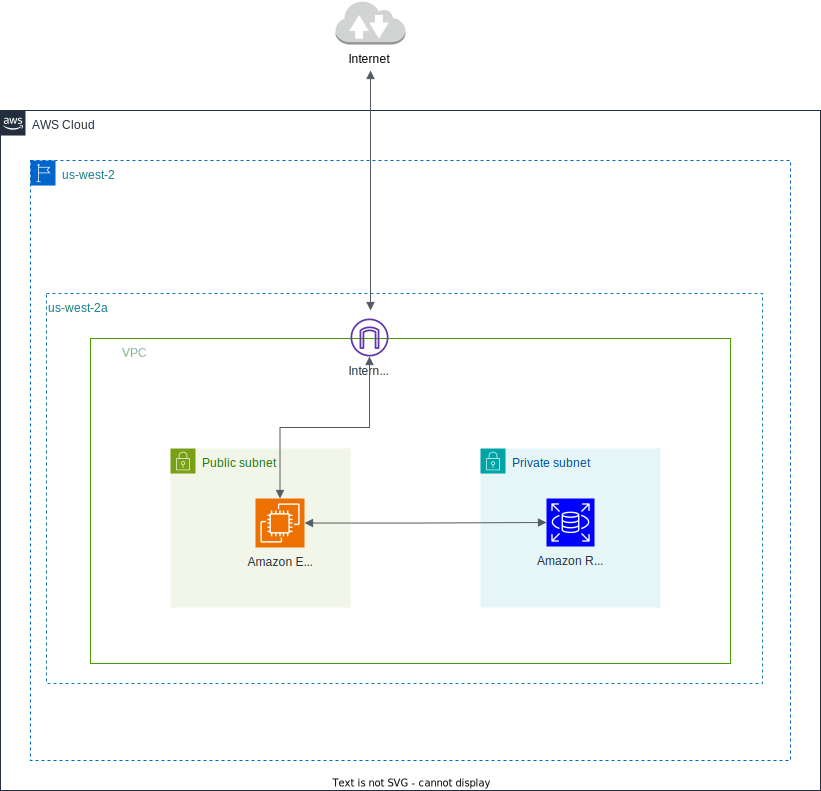

# Text Snippet Sharing Service

[](https://github.com/tkwonn/text-snippet/commits/)
[](https://github.com/tkwonn/text-snippet/actions/workflows/deploy.yml)

## Table of Contents
- [About](#-about)
- [Demo](#-demo)
- [Built with](#️-built-with)
- [Database Schema](#️-database-schema)
- [Cloud Architecture Diagram](#️-cloud-architecture-diagram)
- [Security Measures](#️-security-measures)
- [CI/CD](#-cicd)
- [How to use](#-how-to-use)

## 💡 About

Similar to Pastebin, this web application allows users to share plain text and code snippets without requiring a user account.
It's useful in the following situations:
- Save frequently used code
- Share code snippets with others
- Refer to code shared by others

**URL**: [text-snippet.taesokkwon.com](https://text-snippet.taesokkwon.com)

## 🎨 Demo

https://github.com/user-attachments/assets/32981ce4-cebb-4b1e-be96-f69ac39c033a

The paste is no longer available after the expiration time.

https://github.com/user-attachments/assets/06f831ea-99c5-436a-a176-6b422752ac2b

## 🏗️ Built with

| **Category** | **Technology**                                                                                         |
|--------------|--------------------------------------------------------------------------------------------------------|
| VM           | Amazon EC2                                                                                             |
| Web server   | Nginx                                                                                                  |
| Frontend     | HTML, JavaScript, Bootstrap CSS                                                                        |
| Backend      | PHP 8.3                                                                                                |
| Database     | Amazon RDS (MySQL 8.0)                                                                                 |
| Middleware   | [Custom-built migration tool](https://github.com/tkwonn/text-snippet/blob/main/docs/migration-tool.md) |
| CI/CD        | GitHub Actions                                                                                         |
| Tools        | Monaco Editor                                                                                          |
| Container    | Docker (for local development)                                                                    |

## 🗄️ Database Schema


## 🏛️ Cloud Architecture Diagram



## 🛡️ Security Measures

### HTTP Method Restriction

The application checks content size before submission. If the content size exceeds the limit, the application will return an error message. This feature prevents users from submitting excessively large content.

```php
// php ini configuration
post_max_size = 8M
memory_limit = 128M
max_input_time = 60
max_execution_time = 30
```


For testing, `post_max_size` was intentionally set to a low limit (2KB) to verify the validation functionality. In production, the limit is set to 8MB to accommodate larger code snippets while still protecting against potential abuse.

### Input Sanitization and Character Escaping

- Special characters (`\n`, `\t`, `\'`, `\"`, `\`) are properly escaped/unescaped using PHP's `json_encode()` and `json_decode()` methods.
- All database inputs are parameterized using `mysqli` prepared statements to prevent SQL injection.
- HTML special characters are escaped using `htmlspecialchars()` when displaying titles and metadata.

### Rate Limiting for DoS Protection

The application limits requests based on the client's IP address. 

```
// Nginx configuration

limit_req_zone $binary_remote_addr zone=one:10m rate=10r/m;

server {
    listen 80;
    server_name localhost;
    root /var/www/html/public;
    index index.php index.html index.htm;

    ...
    
    location = /api/paste {
        limit_req zone=one;
        try_files $uri $uri/ /index.php?$query_string;
    }

    ...
}
```

For testing, the rate limit was intentionally set to a low value (2 requests per minute + no burst) to verify the rate-limiting functionality. In production, the limit is set to 10 requests per minute (+ burst=5 nodelay) to accommodate normal API usage while protecting against potential abuse.

https://github.com/user-attachments/assets/b9840b95-15ae-49cd-9e4b-5991fbc897ec

### Secure URL generation

Each paste's URL (`https://{domain}/{hash_id}`) is generated using a cryptographically secure random ID via PHP's `random_bytes()` function.  
This implementation follows [Latacora's Cryptographic Right Answers](https://www.latacora.com/blog/2018/04/03/cryptographic-right-answers/) and utilizes `/dev/urandom`.

The implementation uses:
- A character set of 64 characters for URL-safe encoding
- 8 characters length for the final hash
- Total possible combinations: 64⁸ = 281,474,976,710,656

With such a large number of possible combinations making collisions extremely unlikely, the implementation simply uses a database UNIQUE constraint without any additional collision handling logic.

## 🚀 CI/CD

The project uses GitHub Actions to automate testing and deployment workflows with the following configurations:

#### Continuous Integration

- Dependency caching using Composer to speed up builds
- Code quality checks using PHP CS Fixer

#### Continuous Deployment

- Secure AWS Authentication using OpenID Connect (short-lived tokens)
- Minimal IAM permissions to ensure secure cloud role operations
- AWS Systems Manager (SSM) for secure remote command execution (no direct SSH access or security group changes)

## 📄 How to use

This project uses Docker for local development, making it easy for anyone to run and test the application on their local machine.

1. Clone this repository
```bash
git clone https://github.com/tkwonn/text-snippet.git
cd text-snippet
```

2. Setup the environment variables
```bash
# Copy the example environment file
cp .env.example .env

# Example of .env file content
DATABASE_HOST=mysql
DATABASE_NAME=pastes
DATABASE_USER=user
DATABASE_USER_PASSWORD=password
DATABASE_ROOT_PASSWORD=root_password
```

3. Build and run the containers
```bash
make build
make up

# Initialize the database
make migrate
make seed
```

The application will be available at `http://localhost:8080`


